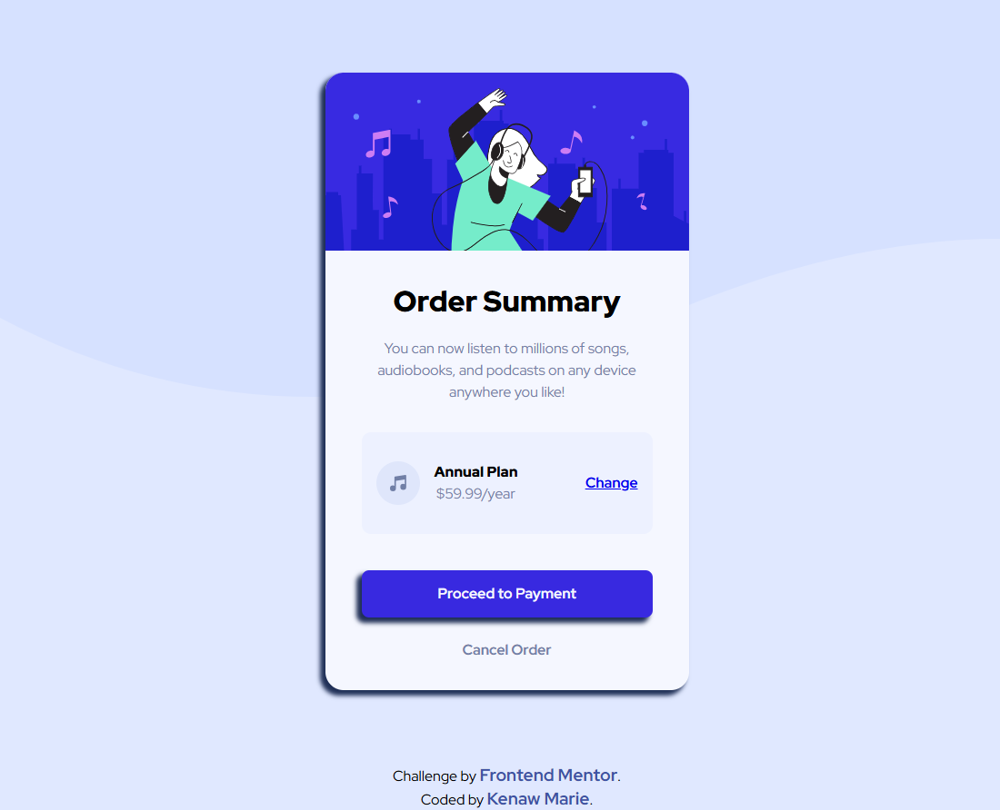

# Frontend Mentor - Order summary card solution

This is a solution to the [Order summary card challenge on Frontend Mentor](https://www.frontendmentor.io/challenges/order-summary-component-QlPmajDUj).

## Table of contents

- [Overview](#overview)
  - [The challenge](#the-challenge)
  - [Screenshot](#screenshot)
  - [Links](#links)
- [My process](#my-process)
  - [Built with](#built-with) 
- [Author](#author)
- [Acknowledgments](#acknowledgments)

## Overview

### The challenge

Users should be able to:

- See hover states for interactive elements

### Screenshot

 

### Links

- Solution URL: [Solution URL](https://github.com/KenawMarie/front-order-summary-component-main)
- Live Site URL: [Live site](https://kenawmarie.github.io/front-order-summary-component-main/)

## My process

### Built with

- Semantic HTML5 markup
- CSS custom properties
- Flexbox
- CSS Grid
 
 

## Author

- Website - [Github](https://github.com/KenawMarie/)
- Frontend Mentor - [kenawMarie](https://www.frontendmentor.io/profile/kenawMarie) 

 

## Acknowledgments

Thanks to frontend mentor for this challenge.
